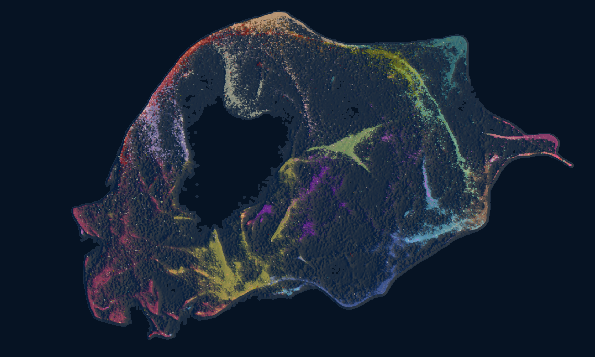

# BU Art Competition

## Outcome

## About the competition

- [Web page](https://www.binghamton.edu/research/division-offices/research-advancement/art-of-science/index.html)
- Deadline Feb 23
- Two categories, **The world around us** and **Visualizing the Unseen**.

## Shared folder
- Raw data: `/data/art`
- Shared folder: https://drive.google.com/drive/folders/1XytENk21iqdhgbwtBCZTm3OPsdRuQn9f?usp=sharing

# How to make the terrain plot

1. Create .xnet file using xnet library
2. Open [HeliosWeb](http://heliosweb.io/docs/example/?advanced&dark&density&size=0.0&layout=0&use2d&densityProperty=Mass) and drag & drop the .xnet file.
3. Set the "Greys" as the colormap. And zoom in as much as possible while displaying the whole object
4. Right click & save the figure
5. Select the node label to the class type you want to color by. You will see a legend on the left.
6. Set the colormap to tab18.
7. Click one class in the legend. Modify the intensity or kernel width appropriately. Then, save the figure. Repeat for all classes except "Others".
8. Put all figures into one folder. Open `plot.py` and edit the path to a folder to the folder with the images.
9. Run `plot.py`.

## Idea sketch
- [Draw & Drop here](https://drive.google.com/drive/folders/1XytENk21iqdhgbwtBCZTm3OPsdRuQn9f?usp=sharing)

